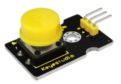
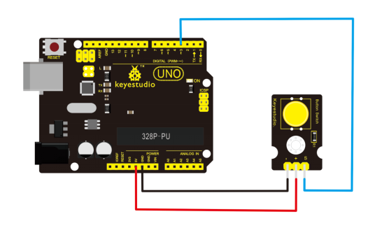
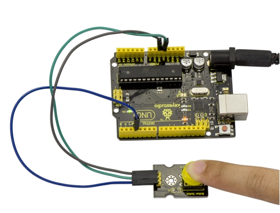
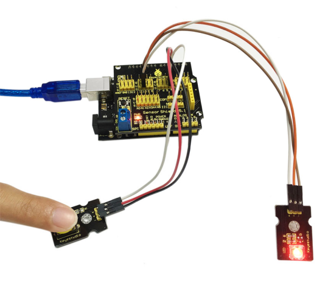

# KS0029 keyestudio Digital Push Button

## 1. Introduction

This is a basic button application module. Momentary Pushbutton Switch usually stays open. When it is pressed down, circuit connected; when it is released, it will bounce back to the status of disconnection.

The module has three pins for easy connection. You can simply plug it into an IO shield to have your first try of Arduino. 



## 2. Details

- Interface: Digital
- Supply Voltage: 3.3V to 5V
- Easy to plug and operate
- Large button keypad and high-quality button cap
- Standard assembling structure
- Easily recognizable pins
- Icons illustrate sensor function clearly
- Achieve interactive works

## 3. Connection Diagram



## 4. Sample Code

Download Code:  [Code](./Code.7z)

```
int ledPin = 13;                // choose the pin for the LED
int inputPin = 3;               // Connect sensor to input pin 3 

void setup() 
{
  pinMode(ledPin, OUTPUT);      // declare LED as output
  pinMode(inputPin, INPUT);     // declare pushbutton as input
}

void loop()
{
  int val = digitalRead(inputPin);  // read input value
  if (val == HIGH) 
  {            // check if the input is HIGH
    digitalWrite(ledPin, LOW);  // turn LED OFF
  } 
  else 
  {
    digitalWrite(ledPin, HIGH); // turn LED ON
  }
}
```

## 5. Result

When you push the digital button, the Led 13 on UNO board will be on. When release the button,the led is off. Shown as below.



## 6. Extension

To obviously observe the LED state, you may connect an LED module. Try to program it by yourself. Press the button to control the LED on and off.

